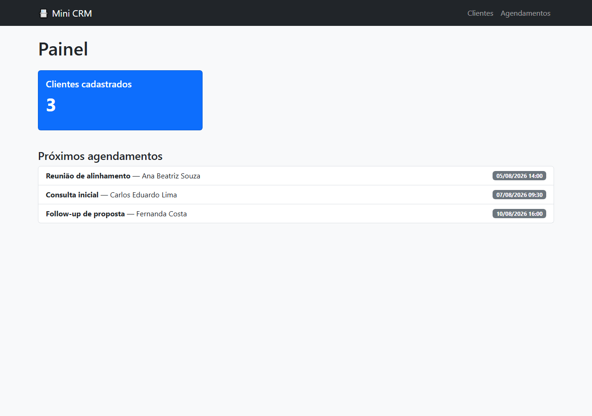
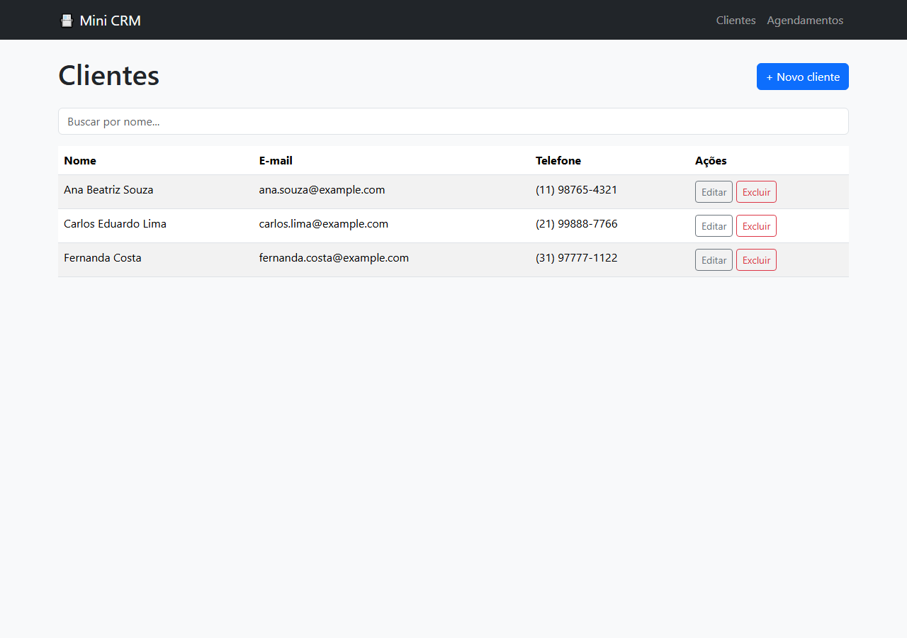
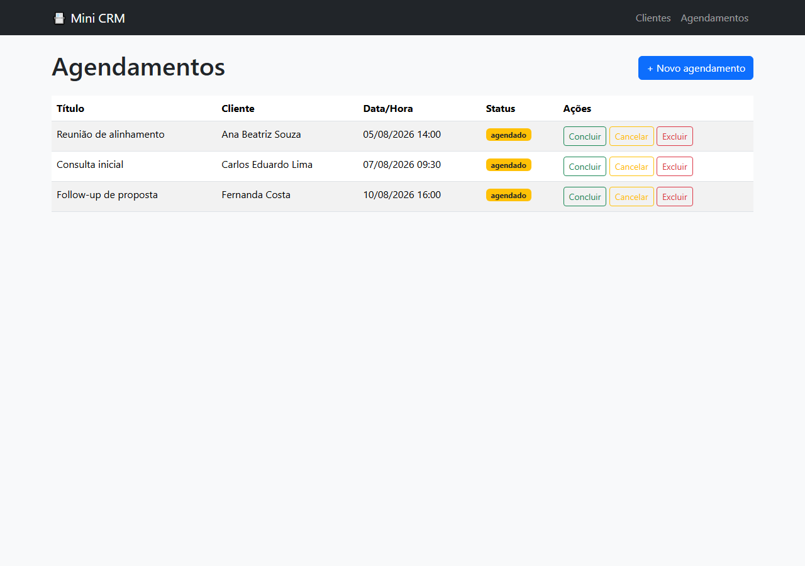

# 📌 Mini CRM + Agendamento

> Aplicação web em Flask para cadastrar clientes e gerenciar agendamentos (reuniões, consultas, atendimentos) com painel de próximos compromissos.


[](LICENSE)

> 🌱 Projeto de aprendizado, feito enquanto eu estudava Flask e desenvolvimento web com banco de dados.

## 🔗 Links

- 🚀 **Deploy:** [mini-crm-agendamento.onrender.com](https://mini-crm-agendamento.onrender.com)

> ⚠️ Hospedado no plano gratuito do Render — a instância "dorme" após um tempo sem uso. A primeira requisição após a inatividade pode levar até ~50 segundos para responder.

## 🧠 Sobre o projeto

Pequenas empresas e profissionais autônomos costumam controlar clientes e agendamentos em planilhas ou papel, o que gera retrabalho e esquecimentos. Esse Mini CRM oferece o essencial de forma simples: cadastro de clientes, agendamento de compromissos vinculados a eles, e um painel com os próximos atendimentos.

## ✨ Funcionalidades

- CRUD completo de clientes (criar, listar com busca, editar, excluir)
- Agendamentos vinculados a um cliente, com data e hora
- Atualização de status do agendamento (agendado, concluído, cancelado)
- Painel inicial com total de clientes e próximos 5 agendamentos
- Mensagens de feedback (flash messages) para todas as ações
- Interface responsiva com Bootstrap 5
- Testes de integração cobrindo as principais rotas

## 🖥️ Prints

| Painel | Clientes | Agendamentos |
|---|---|---|
|  |  |  |

## 🛠️ Tecnologias

- Python 3.10+ / Flask 3
- Flask-SQLAlchemy (ORM) + SQLite
- Jinja2 (templates)
- Bootstrap 5 (via CDN)
- pytest para testes de integração

## 📂 Estrutura do projeto

```
mini-crm/
├── app.py                  # aplicação Flask (models + rotas)
├── templates/               # templates Jinja2
├── static/                  # CSS
├── tests/
│   └── test_app.py
├── requirements.txt
├── docs/
└── README.md
```

## ▶️ Como rodar localmente

```bash
git clone https://github.com/Kashalicov/mini-crm-agendamento.git
cd mini-crm-agendamento

python -m venv venv
source venv/bin/activate   # Windows: venv\Scripts\activate

pip install -r requirements.txt

python app.py
# acesse http://127.0.0.1:5000
```

O banco SQLite (`crm.db`) é criado automaticamente na primeira execução.

## ✅ Testes

```bash
pytest tests/ -v
```

## 📚 O que eu aprendi

Esse projeto foi minha primeira aplicação web completa com Flask usando o padrão MVC-like (models com SQLAlchemy, templates Jinja2, rotas organizadas por recurso). Aprendi a modelar um relacionamento 1:N (cliente → agendamentos) com `cascade="all, delete-orphan"` para manter a integridade dos dados ao excluir um cliente. Também pratiquei testes de integração com o `test_client()` do Flask, usando um banco SQLite em memória para isolar cada teste.

## 🚧 Possíveis melhorias futuras

- Autenticação de usuários (cada usuário vendo só seus próprios clientes)
- Notificações por e-mail/WhatsApp antes de um agendamento
- Visualização em calendário (ex: FullCalendar.js)
- API REST separada do front-end server-rendered

## 👤 Autor

**Júnior Rodrigues**
Coordenador de T.I. na Fundação Banco de Olhos | Estudante de Ciência da Computação
[LinkedIn](https://www.linkedin.com/in/jrkdev/) · [GitHub](https://github.com/Kashalicov)
